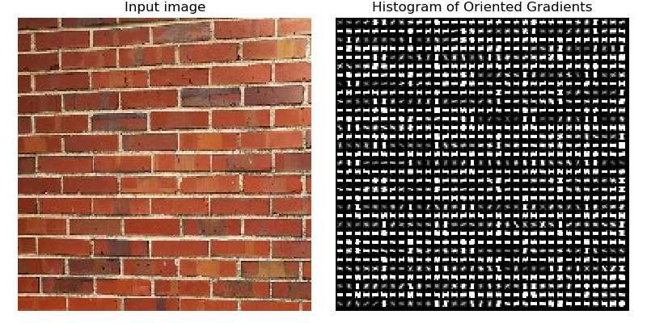

# Prbabilistic Classifier
###### Trained model is saved in model.pkl file
###### one-image.npy and one-label.npy are one image file on which the preprocessing pipeline is ran and features printed
###### features.npy and labels.npy is a test set of features/labels on which pre-trained model will be ran
###### hw02 runs the following pipeline:   Extract and Print Features from one image, Load pre-trained model and test features and run the test diagnostics

# Feature Selection
* OpenCV KAZE feature extractor

* Edge Histogram Descriptor feature extractor

# Classifier Training

**OUTPUT**: 

`Features:`

`[-0.00028973  0.01150659  0.02748683 ...  0.11616631  0.1707832 `
`0.        ]`

`Classification accuracy:`

              precision    recall  f1-score   support

         0.0       1.00      0.56      0.71         9
         1.0       0.94      0.89      0.92        19
         2.0       0.87      1.00      0.93        13
         3.0       0.67      0.67      0.67         9
         4.0       0.71      0.91      0.80        11

    accuracy                           0.84        61
    macro avg      0.84      0.81      0.81        61
    weighted avg   0.85      0.84      0.83        61

`Confusion matrix:`

 `[[ 5  0  0  0  4]
  [ 0 17  0  2  0]
  [0  0 13  0  0]
  [ 0  1  2  6  0]
  [ 0  0  0  1 10]]`

